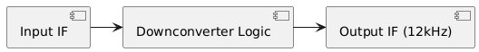

# Hardware Documentation: Downconverter

## 1. Objective
Detail the logic and implementation of the analog IF to 12kHz downconversion stage.

## 2. Logic Flow

## 3. Breakdown
- **Downconversion:** Shifts high IF (e.g., 455kHz) to audio baseband (12kHz).
- **Filtering:** Removes unwanted mixer products.

## 4. Implementation Notes
- Careful calibration of the LO frequency is required for accurate downconversion.
