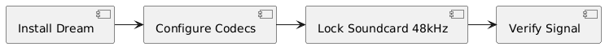

# Setup: Dream Software Configuration

## 1. Objective
Configure the Dream software suite for optimal DRM signal decoding.

## 2. Setup Flow

## 3. Prerequisites
- Dream Software installed.
- Appropriate codecs (`faad2_drm.dll`).
- Sound card locked to 48kHz.

## 4. Verification
- Confirm audio signal presence in the Dream spectrum analyzer.
- Verify successfully decoded OFDM frames.
